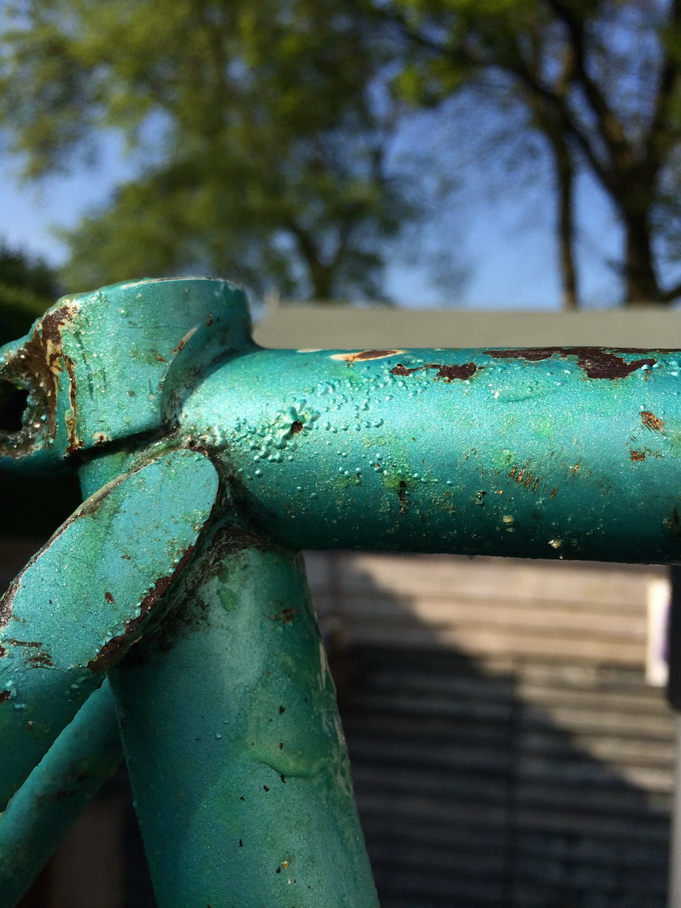
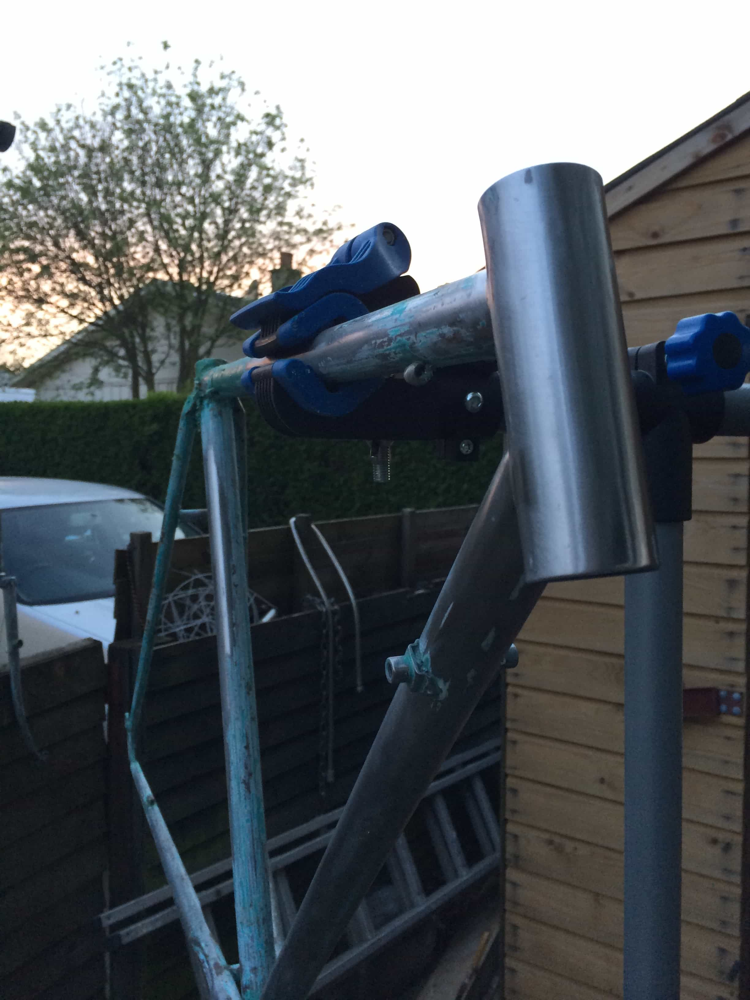
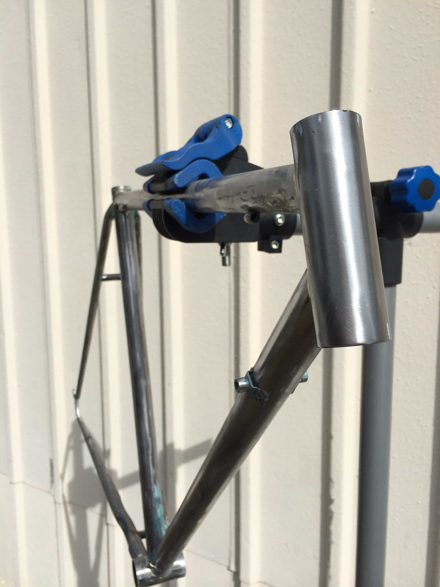
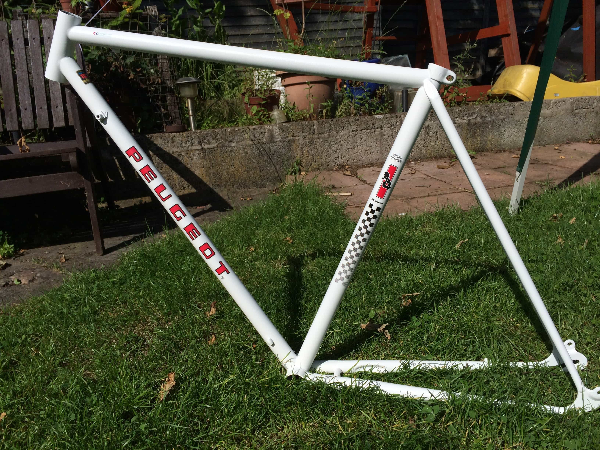
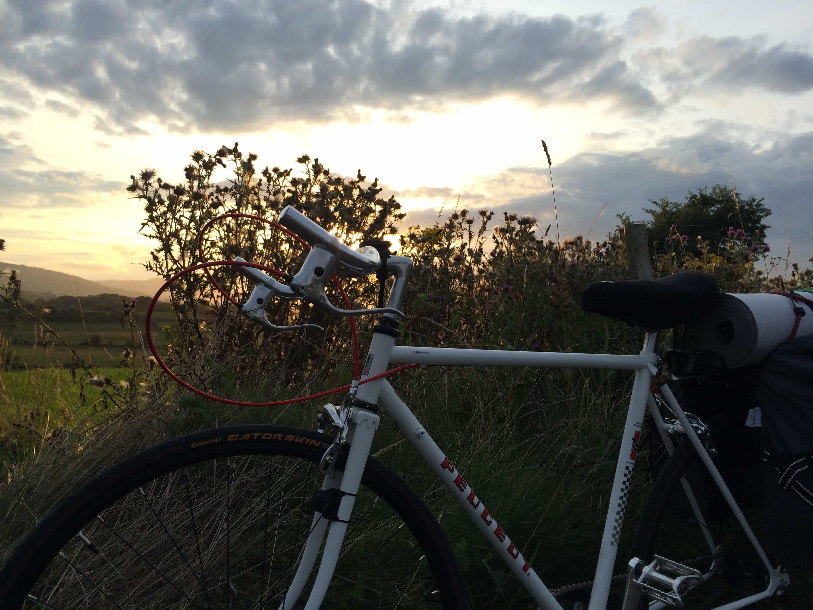
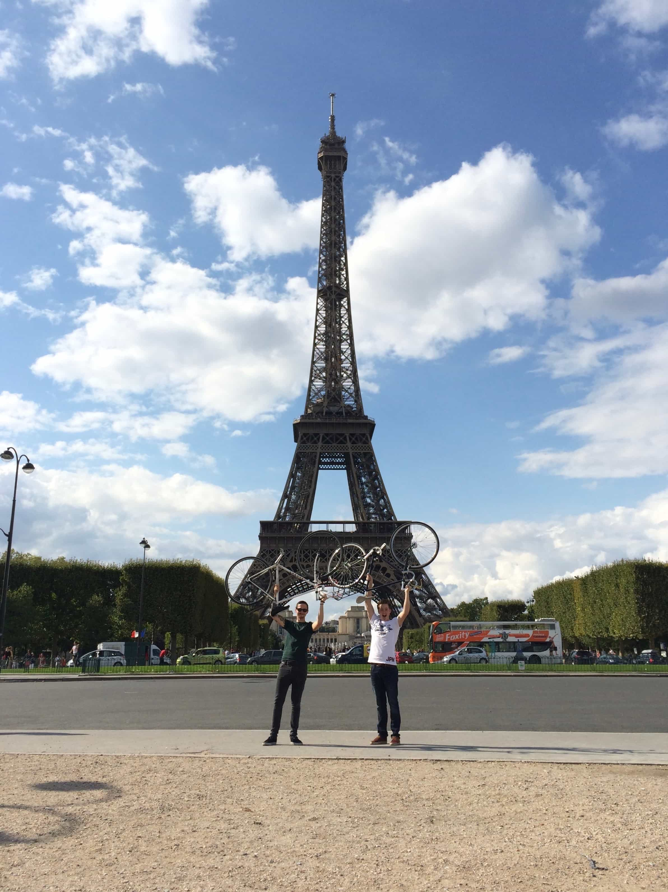
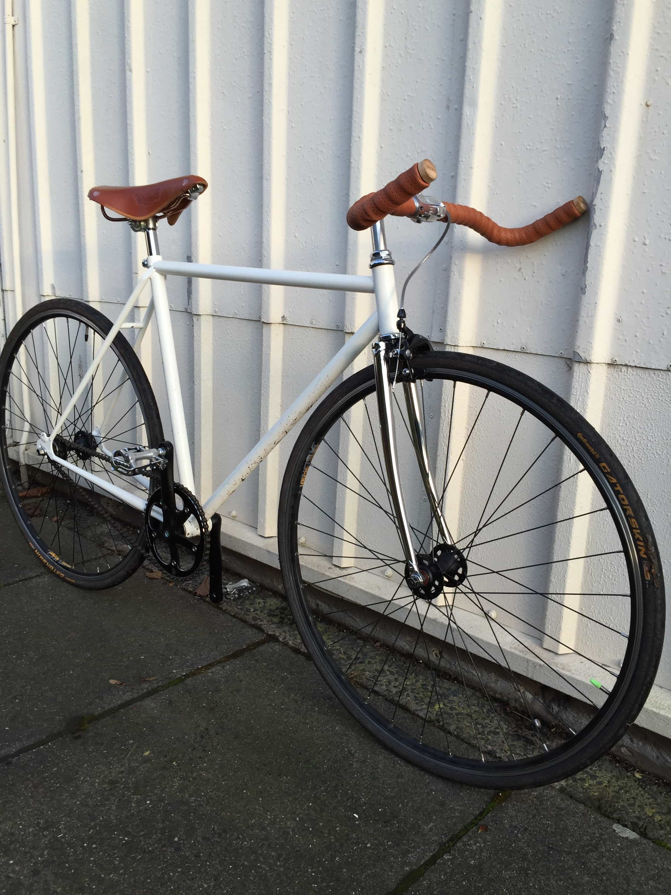

## Original, Untouched and a little tired

I bought this from a middle aged guy in East Belfast - The furthest single journey the bike had travelled was the few miles each day he regularly rode from his parents house to Queens University Belfast and home again, back in the 1970's. Funnily enough, I had never cycled more than a few miles at a time before this Belfast to Paris trip....so we were well matched!

## Bringing it back to steel

Okay, I'm not going to lie - this was hard work. A lot of manual labour, for hours at a time, over 3 days back to back.

The step in stripping everything back to the bare metal frame is getting a solution/product to help weaken and remove the paint from the frame of the bike. We went with one named Nitromorse. It was basically a green goop that you spread on the frame of the bike and leave for a number of hours so it can work it's magic..

After a few bubbles under the paint and many hours passing, I used some abrasive metal brushes to strip 60% of the paintwork.

I then opted for with a sandpaper-esqe drill bit attached to a hand-held drill to help my weary hands strip the remaining stubborn chunks of paint. To finish, I used a range of sandpaper from 100-1400 grit (lower number = higher friction). Started with 100/200 to remove bigger chunks of paint, gradually going higher (1200+) to achieve a smooth finish on the bare stainless steel frame.

Progess was slow and difficult. It required a ton patience and perserverance - so the photo below is the last I took before finishing removing the remaining paint and beginning to prep for fresh paint. Also, time was of the essence...I had booked my Ferry from Rosslare > Cherbourg and my flights for a few months out from the bike refit - I was now commited to the BFS-PAR cycle.

## Paint and Stickers

After a applying a basic primer, I used Rust-Oleum white rattle-can spray paint for the first as seen above.

3 dry/still days | 5 Coats of White paint | 3 Clearcoat/seal | 1 Set of replacement stickers

## A french bike, fit for France

It is built! 15 hours before we set off to Paris...... Why? A few reasons: A Custom wheel building company let us down at the last moment and left us both with very few options for wheels. My handle bars were too big and not compatible with the small older type stem on the Peugeot bike which I found that out 3 days before the start of our journey. Finally and most importantly, we both didn't know how to build bikes. Inexperience, unfortunate turn of events and poor prep led to an incredible amount of stress and anxiety during those last few days before we left for Paris. Many lessons were learnt from that experience and I apply that wisdom now to most things in life to avoid that type of situation from happening again :)

Here it is, the considerable lump of steel held above my head at the Eiffel Tower, Paris. It carried me through Ireland and across north of France with virtually no issues, something which still shocks me to day. No flat tires, blowouts, tears or any real mechanical issues apart from a squeaky bottom bracket on the last 50 miles or so of the journey. I'd definitely call that a win!

## An evolution to city life

 

This is really what I wanted from the beginning but I felt like I had to symbolically revive the peugeot branding for the French trip. However now that I was back and I wanted to use this bike for cycling into the city, I was happy to start again from fresh but, I wouldn't be do the crazy hard labour on stripping the paint/respraying. I found that the rattle can finish isn't super durable and realistically, a powder coat would be the best way to go. *WIP*

