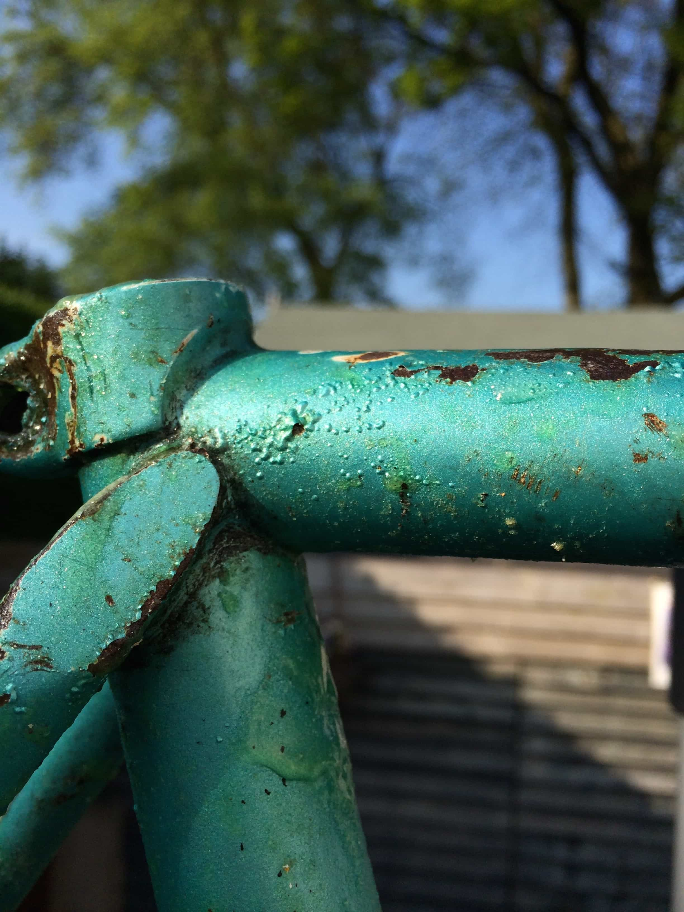
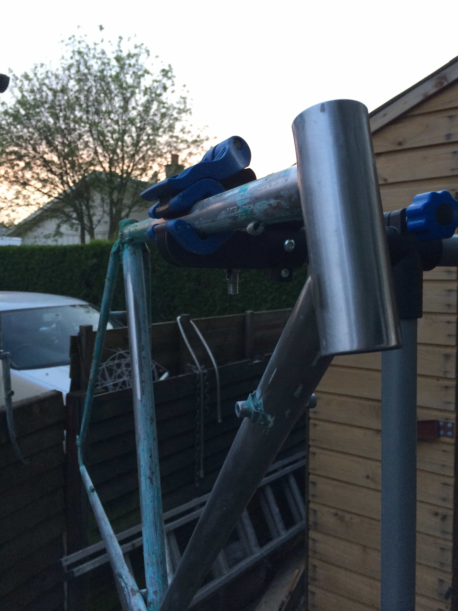
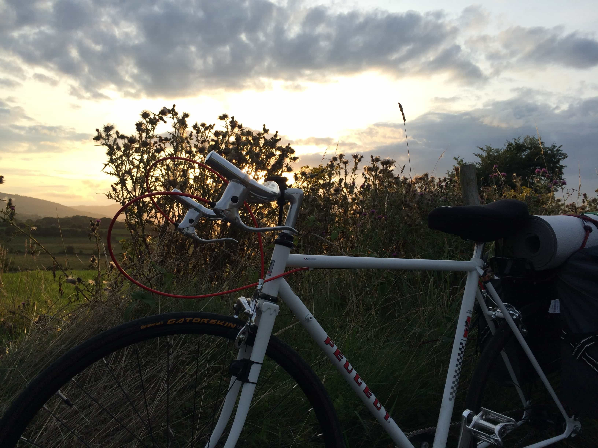

## Original, Untouched and a little tired

I bought this bike from a middle aged guy, in East Belfast. According to him, the bike was used to cycle from his parents house to Queens University Belfast and home again, in the 70's. It had never travelled more than a few miles each day on this journey. Funnily enough, *I* had never cycled more than a few miles at a time before this Belfast to Paris trip....so we were well matched!

## Bringing it back to steel

Okay, I'm not going to lie - this was hard work. A lot of manual labour, for hours at a time, over 3 days, back to back.

This step involved stripping the bike of all its old components (some corroded and seized) and then removing the paint work to bring the frame back to the bare metal. To do this, I first used a solution/product (Nitromorse) to help weaken and remove the paint from the frame of the bike. This was essentially a "green goop" that I had to spread on the frame and leave for a number of hours, so it can work its magic..

After a few bubbles under the paint and many hours passing, I used some abrasive wire metal brushes to remove the majority of the paintwork.

I then opted for a sandpaper-type drill bit attached to a hand-held drill to help my weary hands strip the remaining stubborn chunks of paint. To finish off, I used a range of sandpaper from 100-1400 grit (lower number = higher friction). I started with 100/200 to remove bigger chunks of paint, gradually going higher (1200+) to achieve a smooth finish on the bare stainless steel frame.

Progess was slow and difficult. It required a ton of patience and perserverance - so the photo below is the last one I took before finishing removing the remaining paint and beginning to prep for fresh paint.

## Paint and Stickers

I used a rattle-can spray paint for the primer/main coats and clearcoats. 

After the frame was sprayed and sealed, I got the bottom bracket area chased and faced at a local bike shop.

Once that was complete, it was time to apply the replacement Peugeot stickers.

In total, the result shown below consisted of:

* 5 Coats of white paint
* 3 Clearcoat/seal
* 3 dry/still days
* 1 Set of replacement stickers

## A french bike, fit for France

It was built! **15 hours** before my friend and I set off for Paris...... 

Why on earth did I leave it so late?

A few reasons: A Custom wheel building company let us down at the last moment and left us both with very few options for wheels. My handle bars were too big and not compatible with the small older type stem on the Peugeot bike, which I only found out 3 days before the start of our journey. Finally and most importantly, we both didn't know how to build bikes. All in all, Inexperience, unfortunate turn of events and poor prep led to an incredible amount of stress and anxiety during those last few days before we left for Paris. Many lessons were learnt from that experience and I now apply that wisdom to most things in life to avoid ending up in a similar situation :)

Here it is, the considerable lump of steel held above my head at the Eiffel Tower, Paris. It carried me through Ireland and across north of France with virtually no issues, something which still shocks me. No flat tires, blowouts, tears or any real mechanical issues apart from a squeaky bottom bracket on the last 50 miles or so of the journey. I'd definitely call that a win!

## An evolution to city life

This is really what I wanted from the beginning, but I felt like I had to symbolically revive the Peugeot branding for the French trip. Now that I was back home though, I wanted to use this bike for cycling into the city, so I was happy to start again from fresh...However, I wasn't keen on going through the annoyingly hard labour required for stripping the paint and respraying. I also found that the rattle can finish wasn't super durable and and that realistically a powder coat would be the best way to go, so I decided to leave it with a local powder coat sprayer and get it done professionally. That was £40 well spent.

Luckily, I was also able to source new but retro-style chrome forks to fit to the frame. Many of the more expensive old steel bikes from the 70's and 80's had chrome forks, which was a really nice touch and added a bit of polish and variety to fairly flat frame colors, such as white - and I wanted that look for my bike. 

Over the next year or so, I started geting more into the old school aesthetic and the "long lived materials" such as leather, steel, copper etc. I particularly developed an interest in Brooks saddles. These initially rock-hard saddles seem uncomfortable to ride on, but after about 50-100 miles or so, the saddle literally molds to the shape on your rear end, making for the ultimate comfortable custom-made saddle. Brooks have been making saddles for over 150 years and in my time working in a bicycle shop, I had met a few older and some quite eldery customers who had the same saddle most of their lives and were still pedaling away on them. There's virtually no products we use these days that you can fairly confidently know that you're going to be able to use through the rest of life without the need to replace it - Incredible!

With that in mind, I chose a Brooks saddle in honey brown leather with copper rails and paired it with matching bar tape.

Apart from that, I slapped a modern road brake caliper on the front, reused the original wheel set and replaced the chainset and bottom bracket. 

## A bitter sweet ending

This was a really nice looking bike that rode very well. I thoroughly enjoyed the city rides I had on it but unfortunately, the more I learnt about bike sizing (what height a person should be in relation to which size of bike they should be riding) I realised that this bike was way too small for me and was probably gonna do some long term damage to my back nad knees. With that in mind, I called it a day and regrettably stripped the bike off its part and sold them off individually. I did, however, keep the saddle and I reused it on another build.

Whilst it was a sad ending, I find refurbing and building bikes super enjoyable. There's something really satisfying about seeing a project through from a heap of junk that you wouldn't glance at twice to a respectable mode of transport that you desire and want to use on your cycles.

I refurbed/built and rode several bikes after then, all of which have move been sold on since then for one reason or another but you can see some of them below.

### Carlton

### Surly

### Bikerton

My passion for refurbing and riding bikes hasn't ended though and I'm currently in the process of turning a 30 year old mountain bike into a slick, retro city rider - watch this space!
